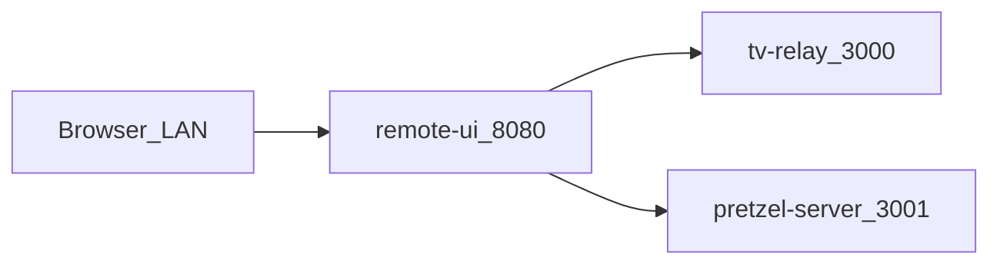

# Pretzel

Node services and scripts that run on the **Pretzel** Pi: LG TV relay, Pi speaker API (TTS, volume, weather, LIFX proxy), and a LAN guest UI (**Vite + React**, built to `remote-ui/dist/`) that proxies to them.

## Components

| Area | Path | Role | Default port | Systemd example |
|------|------|------|--------------|-----------------|
| Pi speaker / TTS / volume / weather / LIFX proxy | [pretzel-server/](pretzel-server/) | Express (`/pretzel/*`, `/lifx/*`, operator **`/pretzel/admin/*`** on **3001**) | **3001** | [pretzel-server/pretzel-server.service.example](pretzel-server/pretzel-server.service.example) |
| LG TV relay (HTTP + WebSocket to TV) | [tv-relay/](tv-relay/) | Express + `ws`; `GET /tv/status` adds `screenOn` via LG `getPowerState` when the main socket is up (standby can leave the socket open) | **3000** | [tv-relay/tv-relay.service.example](tv-relay/tv-relay.service.example) |
| Guest LAN UI + reverse proxy | [remote-ui/](remote-ui/) | Vite + React → `dist/`; `/` home, **`/settings`** operator page; `/tv` → 3000, `/pretzel` and `/lifx` → 3001; **PWA** (manifest + service worker after `npm run build`) | **8080** | [remote-ui/remote-ui.service.example](remote-ui/remote-ui.service.example) |
| Shell helpers | [scripts/](scripts/) | `speak.sh TEXT [INSTRUCTIONS]` → OpenAI speech; no instructions uses **tts-1**, non-empty instructions use **gpt-4o-mini-tts** (see `SPEAK_SCRIPT` in pretzel-server) | — | — |

Ports for pretzel-server and tv-relay are set in their `index.js` files unless you add env-based configuration later.

**LIFX (optional):** Set `LIFX_API_TOKEN` on the Pi for `/lifx/*` on pretzel-server (**3001**). Optional `LIFX_API_URL` defaults to `https://api.lifx.com/v1`. Guests on **8080** use the same-origin path `/lifx/*` (proxied to **3001** by `remote-ui`).

## Operator settings (remote UI)

Operator UI is at **`/settings`** on **8080** (e.g. `http://pretzel.local:8080/settings`). After passcode unlock it runs **git pull** in `PRETZEL_REPO_ROOT`, restarts **pretzel-server** / **tv-relay**, and shows **systemd** last start times (`ActiveEnterTimestamp`). All of that goes to pretzel-server over **`/pretzel/admin/*`** with header **`X-Pretzel-Settings-Passcode`** (must match **`PRETZEL_SETTINGS_PASSCODE`** on the Pi; default matches the bundled UI passcode — rotate the env var for real deployments).

- **`PRETZEL_REPO_ROOT`:** directory passed to `git -C` (default: parent of `pretzel-server`, i.e. the monorepo root on disk).
- **Restart pretzel-server:** the HTTP response returns first; the browser connection then drops when the service restarts. Reload the page to refresh “last restarted” for that unit.
- **sudo:** the service user needs passwordless **`systemctl restart pretzel-server.service`** and **`tv-relay.service`**. If **`systemctl show … ActiveEnterTimestamp`** fails without elevated rights, allow those read-only `show` commands too. Example (replace `william` with your `User=`):

```
william ALL=(root) NOPASSWD: /bin/systemctl restart pretzel-server.service, /bin/systemctl restart tv-relay.service, /bin/systemctl show pretzel-server.service, /bin/systemctl show tv-relay.service
```

Example status check:

```bash
curl -sS -H "X-Pretzel-Settings-Passcode: YOUR_SECRET" http://127.0.0.1:3001/pretzel/admin/status
```

## Traffic flow

Guests on the same Wi‑Fi open the Pi on port **8080**. The UI talks to **relative** URLs `/tv/*`, `/pretzel/*`, and `/lifx/*`; `remote-ui` forwards TV to **3000** and pretzel-server (speaker + LIFX) to **3001**. Installability as a **PWA** (“Add to Home Screen”) generally needs a **secure context** (HTTPS, or `http://localhost` for local dev); plain `http://` to the Pi may still work in the browser but limits install prompts on some platforms.



## Deploy on the Pi (summary)

1. Clone or pull: `cd ~/pretzel && git pull`
2. Install dependencies where there is a lockfile:
   - `cd ~/pretzel/pretzel-server && npm ci`
   - `cd ~/pretzel/tv-relay && npm ci`
   - `cd ~/pretzel/remote-ui && npm ci && npm run build`  
   (`remote-ui` must be **built** after each pull that changes the UI; `dist/` is gitignored. For local UI work: `cd ~/pretzel/remote-ui && npm run dev` — Vite proxies `/tv`, `/pretzel`, `/lifx` to **3000** / **3001**.)
3. Install systemd units from the `*.service.example` files (copy to `/etc/systemd/system/`, edit `User` and `WorkingDirectory`), then:
   - `sudo systemctl daemon-reload`
   - `sudo systemctl enable --now pretzel-server tv-relay remote-ui`  
   (enable only the units you use; start **pretzel-server** and **tv-relay** before **remote-ui**.)

Longer comments and pairing notes for tv-relay are in [tv-relay/tv-relay.service.example](tv-relay/tv-relay.service.example) and [remote-ui/remote-ui.service.example](remote-ui/remote-ui.service.example).

## Release version (`VERSION` and git tags)

- **Repo version:** The file [VERSION](VERSION) holds a single semver line (e.g. `1.3.7`). This is the stack-wide release identifier agents should bump when committing (see [AGENTS.md](AGENTS.md)).
- **Git tags:** To label a release on GitHub, create an **annotated** tag on the release commit, e.g. `git tag -a v1.3.7 -m "Release 1.3.7"` then `git push origin v1.3.7`. Tags appear under the repo’s “Tags”; you can create a **GitHub Release** from a tag for notes and visibility. Prefer tagging intentional releases, not every commit.

## Systemd: which version is running?

Example unit files include an optional env var (commented) you can enable on the Pi:

```ini
# Environment=PRETZEL_STACK_VERSION=1.7.4
```

Set the value to match [VERSION](VERSION) after each deploy. Inspect what systemd passed to a unit:

```bash
systemctl show remote-ui -p Environment
systemctl show tv-relay -p Environment
systemctl show pretzel-server -p Environment
```

**Git commit on the machine (optional):** You can add another line, e.g. `Environment=PRETZEL_GIT_SHA=abc1234`, filled from `git rev-parse --short HEAD` on the Pi when debugging. GitHub commit URL: `https://github.com/<owner>/<repo>/commit/<full-sha>`.

## Quick health checks (on the Pi)

```bash
curl -sS http://127.0.0.1:3000/tv/status
curl -sS http://127.0.0.1:3001/pretzel/status
curl -sS http://127.0.0.1:8080/tv/status
curl -sS http://127.0.0.1:8080/pretzel/status
curl -sS http://127.0.0.1:8080/lifx/scenes
```

If **8080** refuses connections: confirm `remote-ui` is running (`systemctl status remote-ui`), that you ran `npm run build` in `remote-ui` (so `dist/index.html` exists), and read logs: `journalctl -u remote-ui -n 40 --no-pager`. Foreground check: `sudo systemctl stop remote-ui` first if 8080 is busy, then `cd ~/pretzel/remote-ui && node server.cjs` (Ctrl+C to stop). If your unit still says `server.js`, update **ExecStart** to `node server.cjs` after pull.
