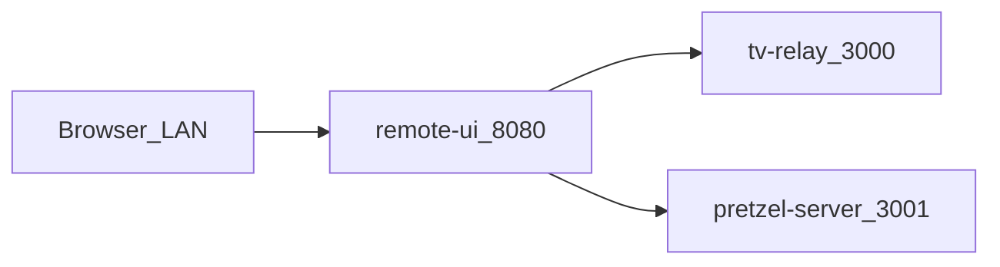

# Pretzel

Node services and scripts that run on the **Pretzel** Pi: LG TV relay, Pi speaker API (TTS, volume, weather, LIFX proxy), and a LAN guest UI (**Vite + React**, built to `remote-ui/dist/`) that proxies to them.

## Components

| Area | Path | Role | Default port | Systemd example |
|------|------|------|--------------|-----------------|
| Pi speaker / TTS / volume / weather / LIFX proxy | [pretzel-server/](pretzel-server/) | Express (`/pretzel/*`, `/lifx/*`, operator **`/pretzel/admin/*`** on **3001**) | **3001** | [pretzel-server/pretzel-server.service.example](pretzel-server/pretzel-server.service.example) |
| LG TV relay (HTTP + WebSocket to TV) | [tv-relay/](tv-relay/) | Express + `ws`; `GET /tv/status` adds `screenOn` via LG `getPowerState` when the main socket is up (standby can leave the socket open) | **3000** | [tv-relay/tv-relay.service.example](tv-relay/tv-relay.service.example) |
| Guest LAN UI + reverse proxy | [remote-ui/](remote-ui/) | Vite + React → `dist/`; `/` home, **`/settings`** operator page, **`/chess`** two-player chess, **`/tetris`** two-player versus Tetris; `/tv` → 3000, `/pretzel` and `/lifx` → 3001; **PWA** (manifest + service worker after `npm run build`) | **8080** | [remote-ui/remote-ui.service.example](remote-ui/remote-ui.service.example) |
| Shell helpers | [scripts/](scripts/) | `speak.sh TEXT [INSTRUCTIONS]` → OpenAI speech; no instructions uses **tts-1**, non-empty instructions use **gpt-4o-mini-tts** (see `SPEAK_SCRIPT` in pretzel-server) | — | — |

Ports for pretzel-server and tv-relay are set in their `index.js` files unless you add env-based configuration later.

**LIFX (optional):** Set `LIFX_API_TOKEN` on the Pi for `/lifx/*` on pretzel-server (**3001**). Optional `LIFX_API_URL` defaults to `https://api.lifx.com/v1`. Guests on **8080** use the same-origin path `/lifx/*` (proxied to **3001** by `remote-ui`).

**TV power:** the **POWER** key in the LG TV panel calls `POST /tv/power/on` on tv-relay, which needs **`TV_WOL_MAC`** (the TV's MAC) to wake it from full off via Wake-on-LAN; from standby it also works over the open WebSocket. If neither is possible the panel shows the relay's error. Turning off needs a second tap to confirm.

## Operator settings (remote UI)

Operator UI is at **`/settings`** on **8080** (e.g. `http://pretzel.local:8080/settings`). After passcode unlock it runs **git pull** in `PRETZEL_REPO_ROOT`, restarts **pretzel-server** / **tv-relay** / **remote-ui**, rebuilds **remote-ui**, and shows **systemd** last start times (`ActiveEnterTimestamp`). All of that goes to pretzel-server over **`/pretzel/admin/*`** with header **`X-Pretzel-Settings-Passcode`** (must match **`PRETZEL_SETTINGS_PASSCODE`** on the Pi; default matches the bundled UI passcode — rotate the env var for real deployments).

- **`PRETZEL_REPO_ROOT`:** directory passed to `git -C` (default: parent of `pretzel-server`, i.e. the monorepo root on disk).
- **Restart pretzel-server:** the HTTP response returns first; the browser connection then drops when the service restarts. Reload the page to refresh “last restarted” for that unit.
- **Restart remote-ui:** same as pretzel-server — remote-ui carries the request, so the response returns first and the page then waits for a new start time and offers **Reload page**.
- **Rebuild remote-ui:** runs in the background on pretzel-server (in `$PRETZEL_REPO_ROOT/remote-ui`): `npm ci` (only when `package-lock.json` is newer than the last install), `tsc --noEmit`, `vite build` into `dist-next/`, swaps it into `dist/`, then restarts remote-ui. A failed build leaves the old `dist/` serving and shows the log tail on the page. Typical flow after a UI change: **Git pull** → **Rebuild remote-ui**. The pretzel-server user needs write access to `remote-ui/` (normally it owns the checkout). Progress: `GET /pretzel/admin/rebuild/remote-ui`.
- **sudo:** the service user needs passwordless **`systemctl restart`** for **`pretzel-server.service`**, **`tv-relay.service`** and **`remote-ui.service`**. If **`systemctl show … ActiveEnterTimestamp`** fails without elevated rights, allow those read-only `show` commands too. Example (replace `william` with your `User=`):

```
william ALL=(root) NOPASSWD: /bin/systemctl restart pretzel-server.service, /bin/systemctl restart tv-relay.service, /bin/systemctl restart remote-ui.service, /bin/systemctl show pretzel-server.service, /bin/systemctl show tv-relay.service, /bin/systemctl show remote-ui.service
```

**First deploy of the rebuild button:** the button lives in the UI it rebuilds, so bootstrap once: add the sudoers line above, tap **Git pull** then **Restart pretzel-server** in the old UI, then trigger the first rebuild by hand:

```bash
curl -sS -X POST -H "X-Pretzel-Settings-Passcode: YOUR_SECRET" http://pretzel.local:8080/pretzel/admin/rebuild/remote-ui
```

Example status check:

```bash
curl -sS -H "X-Pretzel-Settings-Passcode: YOUR_SECRET" http://127.0.0.1:3001/pretzel/admin/status
```

## Chess (`/chess`), Tetris (`/tetris`) and network devices

- **Chess:** open `http://pretzel.local:8080/chess` on two phones. Like Tetris it is a full-screen game with no navbar; it opens on a menu (**Play** → character and name, then **Play White** / **Play Black** / **Watch** as seats allow; **Past games**; **Exit**). In a game the opponent's portrait and name (UnifrakturMaguntia, drawn pixelated) is above the board and yours below, each with a clock and a status line with an LED: green = that player's move ("Your turn", "Thinking…"), amber = check or a draw offer, red = offline (their clock still runs), dim = waiting or finished ("Waiting on you", "Won by checkmate", "Checkmated"). Moves run along the walnut bar at the bottom; before the first move that bar picks the clock (∞ / 5 / 10 / 15|10). **☰** has draw offers, resign, rematch, leave seat, flip board and past games. Leaving the page keeps your seat (per-browser id), so come back on the same phone. pretzel-server is the referee (rules via `chess.js`: check, checkmate, castling, en passant, promotion, stalemate, insufficient material, threefold, 50-move; a flag fall against a lone king is a draw). Before the first move an offline player's seat can be taken, after a game ends anyone can start the next one, and a game both players left for 10 minutes can be cleared (saved as abandoned); Pi downtime is not charged to the clocks. WebSocket at `/pretzel/chess/ws`. The live game is in `pretzel-server/data/chess-state.json`; finished games (SAN moves with timestamps, PGN, result, players; last 200) go to `chess-games.json` (both gitignored), served by `GET /pretzel/chess/games[/:id]`. Portraits react to the last move (`remote-ui/src/lib/chessAvatars.ts`): the side to move looks thoughtful; a check, a capture of anything but a pawn, or a promotion makes the mover smug and the other side shocked until the next move; the game ends on victorious / loss. The two players can't share a character. Every move by either side plays one of three piece clicks (`remote-ui/public/audio/chess-move-*.mp3`, Web Audio, unlocked by the first tap). Each character is a 6-frame 62×62 strip in `remote-ui/public/avatars/chess/`, rebuilt from the source art with `scripts/chess-avatars.py` (Pillow + NumPy). Piece sprites: Cburnett set (CC BY-SA 3.0) in `remote-ui/public/sprites/chess-pieces.svg`; fonts: UnifrakturMaguntia (SIL OFL) for names, Pixelta (Blankids Studio, personal use only) for the board coordinates and status lines. **Pixelta is not in git** (this repo is public): copy `Pixelta.ttf` to `remote-ui/public/fonts/` on the Pi before rebuilding remote-ui, e.g. `scp Pixelta.ttf pi@pretzel.local:~/pretzel/remote-ui/public/fonts/`; without it those labels fall back to Outfit.
- **Tetris:** open `http://pretzel.local:8080/tetris` on two phones (or two tabs: the player id is per tab). It opens as a full-screen game with no navbar and no scrolling; **✕** exits (mid-match it asks first, since leaving forfeits). Joining, waiting, results and **How to play** (**?**) are overlays; the first two to **Join** play, anyone else can **Watch** both boards. Each phone runs its own game from a shared seed sent by pretzel-server, so both get the same 7-bag piece order; the Pi only seats players, starts a 3 s countdown, relays garbage and board snapshots, and decides the winner (first top-out loses). Your board is on the right with Next, the stats and the opponent's board on the left. Controls are round keys on a walnut panel: a larger **⟳** rotate-clockwise key for the left thumb, and a triangle for the right thumb (**◀ ▶** move, hold to slide; **▼** below them, soft drop, double-tap for a hard drop). Clearing 2 / 3 / 4 lines sends 1 / 2 / 4 garbage rows, and your own clears cancel queued garbage first. Hiding the tab for 3 s or disconnecting for 5 s also concedes. **Play again** starts a new match once both players press it. **Music:** the **♪** key (or **Sound** in the lobby) picks the soundtrack, remembered per phone: **Chiptune (MIDI)**, the default, plays `remote-ui/public/audio/tetris-theme-a.mid` (Game Boy Tetris A-theme, sequenced by NeonMickle/Mickle) through a small Web Audio synth (square lead and harmony, wave bass, noise drums) and speeds up 4% per level (up to 1.56× at level 15); **Recording (MP3)** loops `remote-ui/public/audio/tetris-theme.mp3` at its own tempo; or **Off**. Music starts when the countdown ends and stops when the match does. Clearing 2 or 3 lines plays `line-clear.mp3` and a 4-line Tetris plays `tetris-clear.mp3` (NES line-clear sounds, also in `remote-ui/public/audio/`); a single line is silent, and **Off** mutes these effects as well as the music; on iPhone it plays even with the silent switch on (Safari 16.4+). WebSocket at `/pretzel/tetris/ws`; nothing is saved (a pretzel-server restart drops the current match). Server tests: `cd pretzel-server && npm test`.
- **Network devices:** `/settings` (after unlock) lists devices the Pi can see on its LAN (IP, MAC, hostname, state) via `GET /pretzel/admin/devices[?refresh=1]` (cached 15 s). It uses the default-route interface, sends one UDP datagram to every address in its /24 so the kernel ARPs them (no `ping` processes; finds phones that ignore ping), then reads `ip neigh` (falls back to `/proc/net/arp`). Names come from reverse DNS. The router, this Pi, the LG TV (`TV_IP`, default `192.168.1.186`) and seated chess players are labelled; "(private)" marks randomised phone MACs. It shows LAN neighbours, not Wi‑Fi association, so sleeping devices may be missing.

## Traffic flow

Guests on the same Wi‑Fi open the Pi on port **8080**. The UI talks to **relative** URLs `/tv/*`, `/pretzel/*`, and `/lifx/*`; `remote-ui` forwards TV to **3000** and pretzel-server (speaker + LIFX) to **3001**. Installability as a **PWA** (“Add to Home Screen”) generally needs a **secure context** (HTTPS, or `http://localhost` for local dev); plain `http://` to the Pi may still work in the browser but limits install prompts on some platforms.


```mermaid
flowchart LR
  Browser[Browser_LAN]
  RemoteUI[remote-ui_8080]
  TvRelay[tv-relay_3000]
  PretzelSrv[pretzel-server_3001]
  Browser --> RemoteUI
  RemoteUI --> TvRelay
  RemoteUI --> PretzelSrv
```

## Deploy on the Pi (summary)

1. Clone or pull: `cd ~/pretzel && git pull`
2. Install dependencies where there is a lockfile:
   - `cd ~/pretzel/pretzel-server && npm ci`
   - `cd ~/pretzel/tv-relay && npm ci`
   - `cd ~/pretzel/remote-ui && npm ci && npm run build`  
   (`remote-ui` must be **built** after each pull that changes the UI; `dist/` is gitignored. For local UI work: `cd ~/pretzel/remote-ui && npm run dev` — Vite proxies `/tv`, `/pretzel`, `/lifx` to **3000** / **3001**.)
3. Install systemd units from the `*.service.example` files (copy to `/etc/systemd/system/`, edit `User` and `WorkingDirectory`), then:
   - `sudo systemctl daemon-reload`
   - `sudo systemctl enable --now pretzel-server tv-relay remote-ui`  
   (enable only the units you use; start **pretzel-server** and **tv-relay** before **remote-ui**.)

Longer comments and pairing notes for tv-relay are in [tv-relay/tv-relay.service.example](tv-relay/tv-relay.service.example) and [remote-ui/remote-ui.service.example](remote-ui/remote-ui.service.example).

## Release version (`VERSION` and git tags)

- **Repo version:** The file [VERSION](VERSION) holds a single semver line (e.g. `1.3.7`). This is the stack-wide release identifier agents should bump when committing (see [AGENTS.md](AGENTS.md)).
- **Git tags:** To label a release on GitHub, create an **annotated** tag on the release commit, e.g. `git tag -a v1.3.7 -m "Release 1.3.7"` then `git push origin v1.3.7`. Tags appear under the repo’s “Tags”; you can create a **GitHub Release** from a tag for notes and visibility. Prefer tagging intentional releases, not every commit.

## Systemd: which version is running?

Example unit files include an optional env var (commented) you can enable on the Pi:

```ini
# Environment=PRETZEL_STACK_VERSION=1.7.13
```

Set the value to match [VERSION](VERSION) after each deploy. Inspect what systemd passed to a unit:

```bash
systemctl show remote-ui -p Environment
systemctl show tv-relay -p Environment
systemctl show pretzel-server -p Environment
```

**Git commit on the machine (optional):** You can add another line, e.g. `Environment=PRETZEL_GIT_SHA=abc1234`, filled from `git rev-parse --short HEAD` on the Pi when debugging. GitHub commit URL: `https://github.com/<owner>/<repo>/commit/<full-sha>`.

## Quick health checks (on the Pi)

```bash
curl -sS http://127.0.0.1:3000/tv/status
curl -sS http://127.0.0.1:3001/pretzel/status
curl -sS http://127.0.0.1:8080/tv/status
curl -sS http://127.0.0.1:8080/pretzel/status
curl -sS http://127.0.0.1:8080/lifx/scenes
```

If **8080** refuses connections: confirm `remote-ui` is running (`systemctl status remote-ui`), that you ran `npm run build` in `remote-ui` (so `dist/index.html` exists), and read logs: `journalctl -u remote-ui -n 40 --no-pager`. Foreground check: `sudo systemctl stop remote-ui` first if 8080 is busy, then `cd ~/pretzel/remote-ui && node server.cjs` (Ctrl+C to stop). If your unit still says `server.js`, update **ExecStart** to `node server.cjs` after pull.
